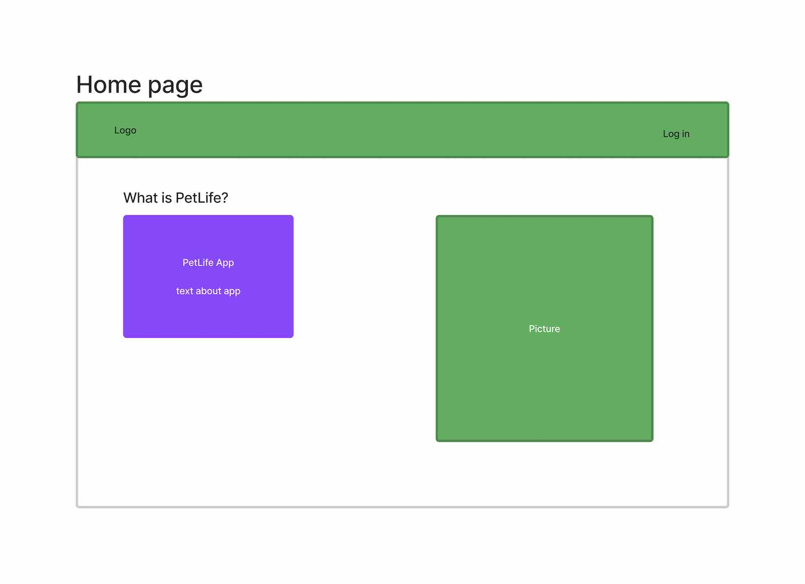
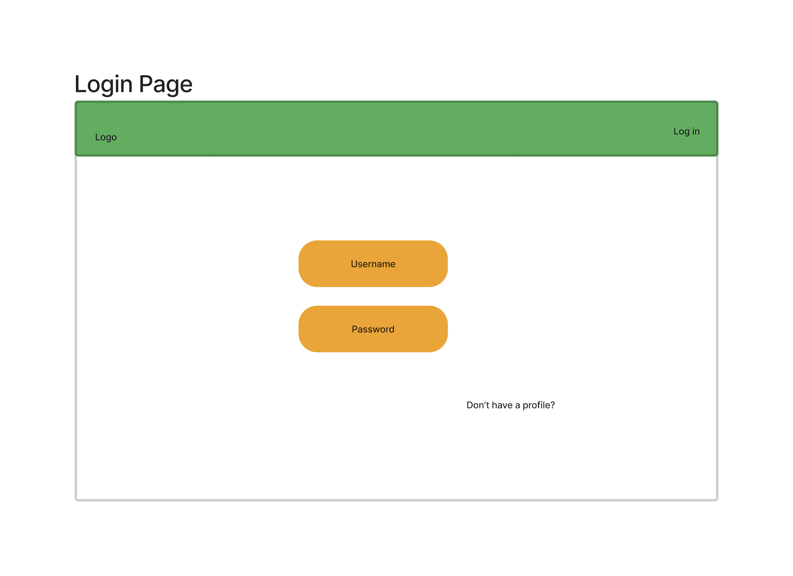
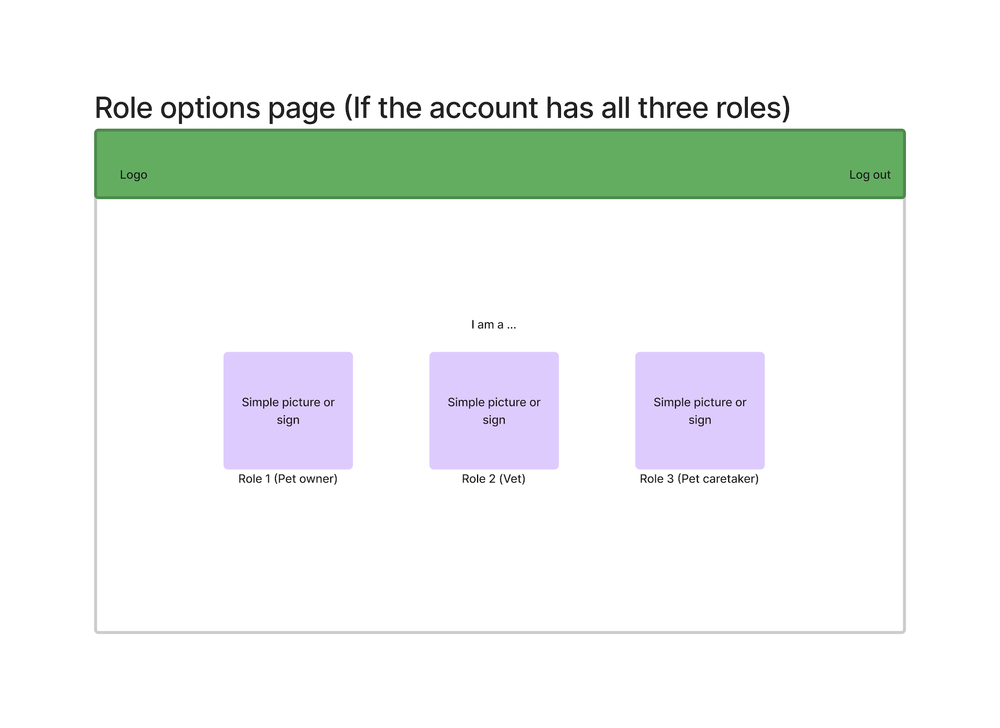
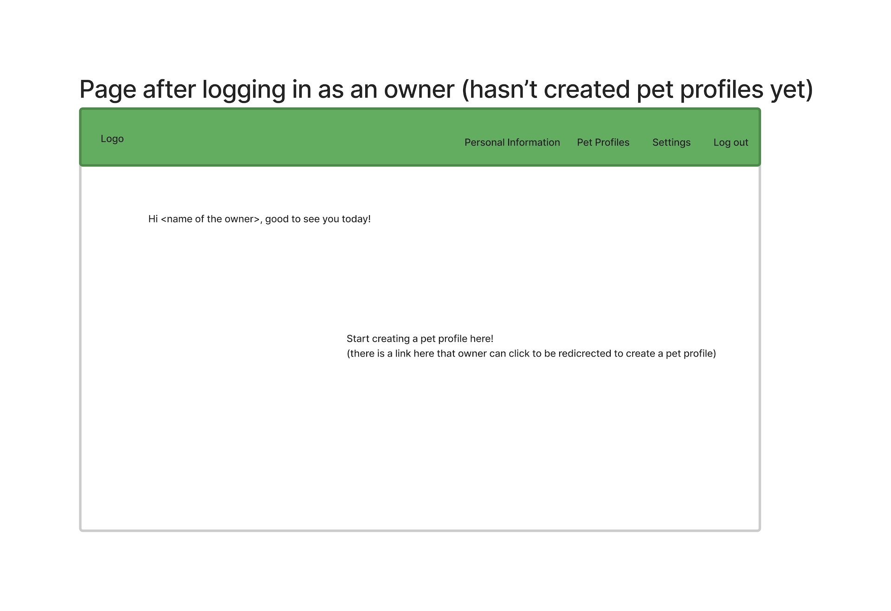

# Project Planning
For this assignment, you'll create some initial plans for your project.

## Assignment Description
[Project Planning Assignment](https://education.launchcode.org/liftoff/modules/assignments/project-planning)

## Submission Instructions

### Wireframes

* **Home Page**  
When a user visit the app, they should be able to learn what the purpose of the app is. They should also be able to log in if they have an account or sign up for a new account. The left part of the page is the description of the app. The right part of the app may be a random picture about the app, like a pet. The upper green part is the navigation bar that exists in all pages of the app with slightly changes. 

* **Login Page**  
This is a page where a user can log in with an existing account. If they do not have an account, they can click a link shown at the bottom of the page.

* **New Profile/Account Page**  
This is a page where a user can create an account. On the left upper part, a user can choose what role the account will be. They have to choose at least one to up to all three. If a user, for example, choose the owner option, the owner functionality will be enabled for the account. 

* **Role Option Page After Loggin in**  
This is the first page after a user who enabled multiple roles logged in. If a user only enbles a role, this page would not show up. In this example, the user enabled all three roles, so the app will prompt the user what role you are loggin in as in this session. 

* **Page After Loggin In As An Owner**  
This is the page after a user logged in as a pet owner. Let us assume that the user has not created any pet profiles yet. The page first greets the user by their name, then the app asks the user if they would like to create any pet profiles. The navigation bar here is also slightly different. The user can access the restricted information related to the account after loggin in through the navigation bar. 

* **Page For A Single Pet Profile After Loggin In As An Owner**  
This is a page for displaying the profile of a specific pet. It contains some information about the pet. 

### Project Tracker

This is the link to our Trello board for PetLife.  
https://trello.com/invite/b/kBvw6pI9/6dd0caa9449cffed29db645d7098fbb3/petlife

### Project Repo Link

This is the link to our PetLife project on GitHub.  
https://github.com/April-2022-LC-LiftOff/pet-life